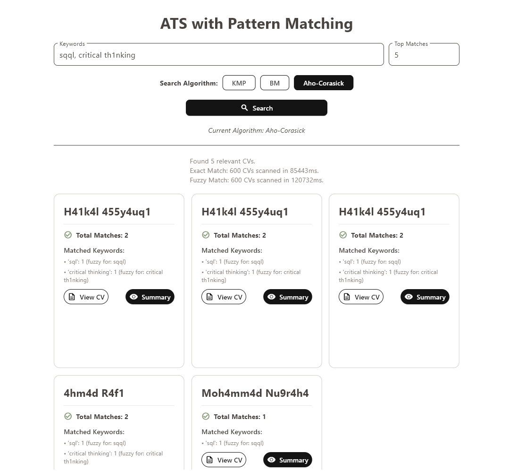

# Tugas Besar Sistem Operasi - IF2130 - 2025

## Project Overview 📋

Tubes3_InfoNama is an Applicant Tracking System (ATS) based on digital CVs, developed as part of the IF2211 Algorithm Strategy course's Big Task 3. This system leverages pattern matching algorithms to efficiently process and analyze digital CVs, aiming to streamline the recruitment process.

<p align="center">
  
  <br>
</p>

---

## Features 🌟

### Pattern Matching Algorithms 🔍

-   Utilizes Knuth-Morris-Pratt (KMP) and Boyer-Moore (BM) for exact keyword matching in CVs.
-   Aho-Corasick is also implemented as a bonus for multi-pattern matching, offering enhanced efficiency for multiple keyword searches.

### Fuzzy Matching 🤖

-   Incorporates Levenshtein Distance (Edit Distance) to handle typos and minor variations in search queries, improving the relevance of search results.

### Data Extraction 📝

-   Employs Regular Expressions (Regex) to automatically extract structured information from unstructured PDF CVs, such as personal details, work experience, skills, and educational history.

### Database Integration 💾

-   Stores applicant profiles and application details in a MySQL/MariaDB relational database.
-   Sensitive data, such as names, birth dates, addresses, and phone numbers, is encrypted using RSA for security.

### User Interface (GUI) 🖥️

-   Provides an intuitive graphical user interface built with Flet, allowing users to input keywords, select algorithms, and view search results with detailed CV summaries.

### Data Seeding 🌱

-   Supports two methods for populating the database: an official seeder using static SQL data and a Faker-based seeder for generating dummy data.

### Performance Metrics ⏱️

-   Records and displays runtime for exact and fuzzy matching processes, providing insights into algorithm efficiency.

## Badges 🏷️

[](https://www.python.org/)
[](https://www.w3schools.com/sql/)
[](https://flet.dev/)

---

## Technical Specifications ⚙️

The application's core logic is implemented in Python, utilizing the following key libraries:

-   `mysql.connector`: To interact with the MariaDB database, ensuring compatibility with MySQL.
-   `python-dotenv`: For secure management of environment variables.
-   `PyPDF2`: Used for extracting text content from PDF CVs.
-   `re`: Python's built-in module for regular expressions, utilized for pattern matching and data extraction.
-   `Flet`: The framework employed for developing the desktop graphical user interface (GUI).

---

## How To Setup 🔧

If uv has not been installed

```bash
pipx install uv
uv --version
uv pip install .
```

To connect with venv

```bash
uv venv # If venv has not been created

# For Windows
.venv/Scripts/activate

# For UNIX
source .venv/bin/activate
```

Install dependencies

```bash
uv pip install -r requirements.txt
```

Create Database

```bash
# 1. Create new .env file in root with this content:
MYSQL_USER=your_username
MYSQL_PASSWORD=your_password

# 2. Generate your public and private key:
uv run src/database/rsa.py

# You can use the provided .env.example file as a template:
cp .env.example .env

# 3. Create database and tables if hasn't been created
uv run src/database/create_tables.py

# 4. Seed the database (creates tables + inserts + encryption)
uv run src/database/official_seeder.py

# or use the random seeder:
uv run src/database/seeder.py
```

## How To Run ▶️

Run the program

```bash
uv run src/main.py
```

## Bonus 🎁

### Bonus Table

| Feature                      | Status |
| ---------------------------- | ------ |
| Profile Applicant Encryption | ✅     |
| Aho-Corasick Algorithm       | ✅     |
| Group Video                  | ✅     |

---
